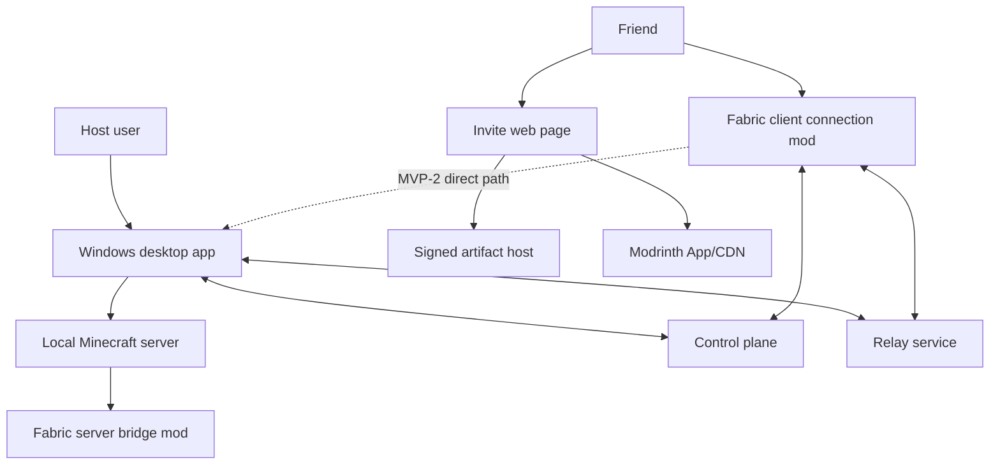

# Local Minecraft Mod Room Desktop App Plan

## Problem Frame

Non-developer Minecraft Java users want a private modded room for friends without learning server setup, Java runtime management, mod compatibility, firewall rules, port forwarding, NAT, Docker, or VPN tools. The product should feel like making a multiplayer room: the host creates a room on a Windows PC, shares an invite, approves first-time friends, and plays.

The Minecraft server process and world run on the host user's PC. This is not a cloud Minecraft hosting product and should avoid the monthly server-rental model. Remote friends still join from different locations, but the networking and setup details are hidden behind an invite flow and a required Modrinth pack.

### Competitive Wedge

The MVP should win on a narrow promise:

> A non-developer can host a private, modded Minecraft Java room from their own PC, and friends can join through a guided Modrinth pack flow without Hamachi, port forwarding, or a rented server.

| Alternative | Why users use it | Where this product wins |
|---|---|---|
| Essential Mod | Simple friend hosting inside Minecraft | This product targets curated dedicated mod rooms, host approval, room lifecycle, and generated friend packs. |
| Hamachi/Tailscale/ZeroTier | Avoids port forwarding | Friends should not install or understand VPN tools. |
| Cloud Minecraft hosting | Reliable public address | The room runs on the host PC and avoids recurring rental cost. |
| Manual Modrinth/CurseForge pack sharing | Flexible mod setup | The host gets guided room creation, fixed pack generation, approval, and connection setup. |

### Success Criteria

- A non-developer host can choose an app-supported Minecraft version and create a Fabric room from a fixed verified pack without reading network instructions.
- A first-time friend can open an invite link, apply the Modrinth pack, launch Minecraft, and reach approval waiting state with no support intervention.
- The host can approve or deny the first join request without leaving the desktop app.
- Relay-only alpha cannot run without room/player/time/bandwidth guardrails.
- User-facing screens use room language; server/network terminology is reserved for advanced diagnostics.

### Requirements Trace

| ID | Requirement | Source decision |
|---|---|---|
| R1 | Target non-developer Minecraft Java users opening private friend rooms. | User stated target persona and goal. |
| R2 | Hide server/network concepts from default UX. | User emphasized users should not know server/contact/network problems. |
| R3 | Do not use Docker as the default route. | User agreed Docker is unsuitable for non-developer default UX. |
| R4 | Run the Minecraft server locally on the host PC. | User rejected cloud hosting and clarified host-room model. |
| R5 | Friends should not install Hamachi/Tailscale/ZeroTier-style VPN apps. | User prioritized convenience over separate connection tool installation. |
| R6 | Use an Essential Mod-like connection model embedded in the required modpack. | User adopted this direction. |
| R7 | Use Modrinth App first, with future CurseForge and Prism Launcher expansion. | User selected Modrinth-first approach. |
| R8 | Start from verified recommended/popular mods, not open-ended mod search. | User chose curated discovery for non-developer onboarding. |
| R9 | Show compatibility as risk guidance, not absolute guarantees. | User selected possibility labels and conflict advice. |
| R10 | Combine invite code/link access with host approval. | User selected hybrid invite and first-join approval model. |

---

## Vocabulary And UX Rules

| Concept | User-facing term | Internal/advanced term |
|---|---|---|
| Minecraft server process | room | server |
| Relay/tunnel/control plane | room connection | relay, tunnel, control plane |
| `.mrpack` | friend modpack file | `.mrpack` |
| Fabric loader | mod setup detail | Fabric |
| Compatibility enum | ready, caution, likely to fail | `high_confidence`, `caution`, `likely_fail` |

Default host, invite, Minecraft mod, and error screens should avoid `server`, `port`, `NAT`, `firewall`, `VPN`, `relay`, and `tunnel`. These terms are allowed in advanced diagnostics, logs, support bundles, and developer documentation.

---

## Phased Delivery

### Gate 0: Desktop Host Invite Flow Validation

Before building the full relay/control-plane stack, validate the riskiest user behavior from the correct product entry point: a non-developer host opens the desktop app, prepares a room, creates an invite, and understands the approval request flow. The friend invite page is a secondary helper surface for applying the private Modrinth pack and reaching a clear "waiting for host approval" state.

Success metrics:

- Host time from app open to invite creation.
- Time from invite link open to Minecraft launch.
- Pack import completion rate.
- Number of support interventions.
- Drop-off point if the friend fails.

### MVP-0: Relay-Only Closed Alpha

Goal: prove room creation, fixed pack install, invite, first-join approval, and actual play through relay-only transport.

MVP-0 includes:

- 1-3 fixed verified Fabric packs per app-supported Minecraft version instead of a generalized mod catalog.
- Minimal control plane for rooms, invites, approvals, presence, and session credentials.
- Desktop host app for local room creation and approval.
- Fabric server bridge and client connection mod.
- Loopback TCP proxy connection model for the client mod.
- Relay service with fail-closed quota/abuse controls.
- Invite web page with Modrinth-first guidance and failure recovery.

Default alpha limits until measured:

- One active room per host account/device.
- Up to 9 invited friends per room, 10 total players including the host.
- Six hours per room session.
- Idle timeout after 20 minutes with no approved friends connected.
- Relay bandwidth soft warning at 25 GB per room session and hard cap at 40 GB per room session.
- Per-host monthly relay cap of 150 GB during closed alpha.
- Invite links expire after 24 hours unless the host regenerates them.
- Approval requests are rate-limited per invite, IP/device signal, and Minecraft identity signal.
- At the hard cap, block new joins, show a room-language warning, give a short grace period, then close the relay session fail-closed.
- No public discovery; invite pages are `noindex`.

### MVP-1: Curated Catalog And Compatibility

Goal: move from fixed packs to a curated recommended/popular mod catalog with compatibility guidance.

MVP-1 includes:

- Modrinth metadata ingestion.
- Loader/version/dependency verification.
- Side-aware client/server/both classification.
- Risk labels: `high_confidence`, `caution`, `likely_fail`.
- Known conflict guidance and automatic dependency suggestions.

### MVP-2: Direct P2P Beta

Goal: reduce relay cost and latency by trying direct P2P first and falling back to relay.

MVP-2 includes:

- Candidate exchange through control plane.
- NAT traversal implementation.
- Automatic relay fallback.
- IP privacy copy and opt-in/default policy.
- Direct success, fallback, latency, disconnect, and relay byte metrics.

---

## Scope Boundaries

### MVP-0 In Scope

- Windows desktop GUI app for hosts.
- Local Minecraft Java room creation, launch, stop, status, and redacted logs.
- Fabric-first room bootstrap.
- Fixed verified Fabric packs for the app-supported Minecraft versions.
- Private Modrinth pack generation and invite download.
- Host app, Fabric server bridge mod, Fabric client connection mod.
- Web invite code/link plus first-time host approval.
- Relay-only room connection with strict guardrails.
- Minimal privacy, authorization, quota, and support-bundle redaction.

### Deferred To Follow-Up Work

- Generalized recommended/popular mod catalog.
- Full compatibility engine and conflict-risk scoring.
- Direct P2P NAT traversal.
- Forge and NeoForge support.
- CurseForge ZIP exporter.
- Prism Launcher-specific import UX.
- Public Modrinth project publishing and automatic update channels.
- World backup/sync, cloud save, and advanced room settings.
- Public room discovery or large community moderation.

### Out Of Scope

- Cloud-hosted Minecraft server rental.
- Docker as the default user-facing flow.
- User-taught port forwarding, firewall rule editing, or VPN setup as the primary path.
- Bedrock Edition.
- Payment, marketplace, cosmetics, or room monetization.
- Arbitrary unsafe mod JAR uploads as a first-class MVP feature.

---

## Key Technical Decisions

| Decision | Direction | Rationale |
|---|---|---|
| Desktop shell | Tauri + React/TypeScript + Rust core | Windows GUI plus local process, filesystem, and network control. |
| Control plane stack | TypeScript/Fastify service with PostgreSQL for alpha state | Keeps web/control-plane code in one TS stack while making invites, approvals, and TTL state persistent. |
| Relay stack | Rust/Tokio TCP relay service | Relay is I/O heavy and must fail closed under quota/authorization rules. |
| MVP loader | Fabric first | Fabric server setup and Modrinth compatibility are the simplest first slice. |
| Version selection | Host chooses Minecraft version from an app-supported list | The user understands Minecraft version better than Fabric Loader or Java; the app owns the technical mapping. |
| Fabric Loader policy | Automatically install a stable Fabric Loader compatible with the selected Minecraft version | Loader choice is not a user-facing decision. |
| Java runtime policy | Use an existing compatible Java runtime when present; prompt installation only when none is available | Reduces setup friction while still making local server launch reliable. |
| Initial pack strategy | Fixed verified packs before generalized catalog | Tests the core room/join loop before taking on compatibility product complexity. |
| Friend connection | Modrinth pack includes client connection mod | Avoids separate VPN tools while using the modpack setup friends already need. |
| Client connection model | Client mod opens `127.0.0.1:<ephemeral>` loopback TCP proxy | Fixes the MVP join mechanism and avoids leaving U6/U7 to choose between incompatible approaches. |
| Alpha connection mod distribution | Signed HTTPS release artifact referenced by generated `.mrpack` | Provides stable URL/hash/file size for importable packs; public Modrinth publishing is later. |
| Security model | Invite link plus first-join host approval | A leaked link only creates a join request; it does not grant room access. |
| Approval identity | Server-observed authenticated Minecraft UUID is authoritative | Control-plane/device identity may label a request, but the server bridge confirms the player identity before allowlisting. |

---

## High-Level Technical Design

> This illustrates the intended approach and is directional guidance for review, not implementation specification.

### Friend Onboarding States

| State | Friend-facing action | Recovery |
|---|---|---|
| Invite opened | Review room invitation and install/apply friend modpack | Ask host for a new invite if expired. |
| Modrinth App not detected | Install Modrinth App, then import pack | Provide manual download fallback and short help. |
| Pack downloaded | Import into Modrinth App | Show "Open in Modrinth" and "Download again". |
| Import failed | Retry import or download fresh pack | Explain that the pack is for Minecraft Java on desktop. |
| Unsupported device/browser | Switch to Windows desktop | Do not expose room details beyond safe metadata. |
| Minecraft launched | Select the generated room profile | Show exact profile name and expected room state. |
| Approval pending | Wait for host approval | Allow retry/request host reminder after timeout. |
| Approved | Join room | Persist approval for future joins according to room policy. |
| Denied/blocked | Stop join attempt | Explain host decision without exposing internal details. |
| Host offline | Wait or ask host to open room | Show room closed state. |

### Host Approval States

| State | Host app behavior | Friend behavior |
|---|---|---|
| `pending` | Show request with Minecraft name, UUID status, invite source, and approve/deny/block actions. | Waiting for host approval. |
| `approved` | Add authenticated UUID to allowlist and room policy. | Join proceeds. |
| `denied` | Reject current request without permanent block. | Ask host for approval again. |
| `blocked` | Reject future requests for the identity/device signals. | Explain access is blocked. |
| `expired` | Remove stale request. | Show retry action. |
| `host_unavailable` | Queue is not actionable. | Show room closed or host unavailable. |
| `already_allowed` | Do not prompt host again unless policy changes. | Join proceeds. |
| `identity_changed` | Require re-approval if observed UUID and displayed identity no longer match expectations. | Show re-approval pending. |

### User-Facing Error Matrix

| Situation | Host message | Friend message | Primary CTA | Technical details location |
|---|---|---|---|---|
| Missing Java/runtime | Room setup needs one more component. | N/A | Fix setup | Advanced diagnostics |
| Server process crash | Room stopped unexpectedly. | Host needs to reopen the room. | Restart room | Redacted logs |
| Invite expired | Create a new invite. | Ask host for a new invite. | New invite | Hidden |
| Pack import failed | N/A | The friend modpack did not apply. | Download again | Help panel |
| Host offline | Open the room to let friends join. | Room is closed right now. | Notify host | Hidden |
| Relay quota exceeded | Room connection limit reached. | Room connection limit reached. | End/reopen later | Advanced diagnostics |
| Approval timeout | Review or clear pending requests. | Host did not respond yet. | Request again | Hidden |

### Trust Panel Requirements

The invite page should show:

- Host-chosen room alias, not host account email or sensitive identifiers.
- Minecraft Java version and expected Modrinth profile name.
- What the friend modpack includes, including the required connection mod.
- Clear unofficial-product notice: the app is not an official Minecraft, Mojang, or Microsoft product and is not endorsed by them.
- Statement that the flow never asks for Microsoft/Minecraft passwords.
- What data is shared before approval.
- Safe path to request a fresh invite.

### Accessibility Requirements

- Host approval can be completed keyboard-only.
- Visible focus states on desktop and invite web.
- Screen-reader labels for room status, approval state, and install state.
- Invite page works on narrow mobile browsers, even though joining requires desktop Minecraft Java.
- Interactive targets are at least 44px.
- Reduced-motion mode for install/progress animations.

---

## Implementation Units

### MVP-0 Required Units

#### U1. Greenfield Monorepo Foundation

**Phase:** MVP-0 required
**Ship blocker:** yes
**Responsibility:** Establish the app, service, shared package, and mod workspace layout.

**Proposed files:** `package.json`, `pnpm-workspace.yaml`, `apps/desktop/`, `apps/invite-web/`, `services/control-plane/`, `services/relay/`, `packages/protocol/`, `mods/client-fabric/`, `mods/server-bridge-fabric/`

**Tests:** `tests/smoke/workspace-structure.test.ts`

**Scenarios:**

- Workspace discovery finds every package and each package exposes expected lint/test targets.
- Empty optional packages fail CI with clear messages instead of silent skips.
- The directory structure makes ownership clear to a new implementer.

#### U2. Protocol, State, And Permissions

**Phase:** MVP-0 required
**Ship blocker:** yes
**Responsibility:** Define shared room, invite, approval, session, tunnel, install-state, error-state, risk-label, and actor-permission contracts.

**Proposed files:** `packages/protocol/schemas/room.yaml`, `packages/protocol/schemas/approval.yaml`, `packages/protocol/schemas/transport.yaml`, `packages/protocol/schemas/modpack.yaml`, `packages/protocol/src/`, `docs/architecture/protocol.md`

**Tests:** `packages/protocol/tests/schema-compatibility.test.ts`, `packages/protocol/tests/permission-contract.test.ts`

**Scenarios:**

- Host creates and revokes an invite; friend creates a join request; only host can approve or deny it.
- Expired or revoked invite code does not reveal sensitive room metadata.
- Older client mod ignores unknown response fields without breaking the join flow.
- Risk labels are limited to `high_confidence`, `caution`, `likely_fail`.

**Actor permission matrix:**

| Action | Host | Friend | Service admin |
|---|---|---|---|
| Create/revoke invite | yes | no | break-glass only |
| Read safe invite status | yes | yes with valid token | yes |
| Read approval queue | yes | own request only | yes |
| Approve/deny/block join | yes | no | no by default |
| Issue room session | service after authorization | no direct issue | no direct issue |
| Read relay metrics | own room summary | no | yes |

#### U3. Control Plane MVP

**Phase:** MVP-0 required
**Ship blocker:** yes
**Responsibility:** Manage rooms, invite TTL/revocation, approval queue, presence heartbeat, session credentials, and rate-limit hooks.

**Proposed files:** `services/control-plane/src/rooms/`, `services/control-plane/src/invites/`, `services/control-plane/src/approvals/`, `services/control-plane/src/presence/`, `services/control-plane/src/sessions/`, `services/control-plane/src/rate_limits/`

**Tests:** `services/control-plane/tests/room-flow.test.ts`, `services/control-plane/tests/rate-limit.test.ts`, `services/control-plane/tests/privacy-contract.test.ts`

**Scenarios:**

- Host online -> invite created -> friend join request -> host approves -> short-lived session issued.
- Host offline returns a room-closed state without exposing host network details.
- Invite brute force and repeated join requests are rate-limited.
- Approval queue exposes display metadata but not credentials or private host details.

**MVP stack decision:** TypeScript/Fastify service, PostgreSQL persistence for rooms/invites/approvals/session metadata, TTL columns for expiry, heartbeat timestamps for presence, and fail-closed responses when state is missing or invalid.

#### U4. Server Bootstrap And Desktop Host App

**Phase:** MVP-0 required
**Ship blocker:** yes
**Responsibility:** Provide host-facing GUI, local room lifecycle, Minecraft version selection, Fabric server bootstrap, EULA consent, Java/runtime validation, redacted logs, and approval UI.

**Proposed files:** `apps/desktop/src/`, `apps/desktop/src-tauri/`, `apps/desktop/src-tauri/src/server_lifecycle/`, `apps/desktop/src-tauri/src/bootstrap/`, `apps/desktop/src-tauri/src/approvals/`, `apps/desktop/src-tauri/src/tunnel/`

**Tests:** `apps/desktop/src-tauri/tests/server_bootstrap.rs`, `apps/desktop/src-tauri/tests/server_lifecycle.rs`, `apps/desktop/src/__tests__/approval-ui.test.tsx`

**Scenarios:**

- Selected Minecraft version and fixed pack create room files, capture EULA consent, and start the local Fabric server.
- Missing compatible Java, offline download failure, checksum failure, and crash states show room-language recovery.
- Approval panel supports approve, deny, block, expire, already allowed, and identity changed states.
- Default UI avoids server/network terminology; advanced diagnostics remain available.

**Bootstrap policy:** The host chooses a Minecraft version from the app-supported list. The app then selects a compatible stable Fabric Loader and checks for a compatible Java runtime. If one is already available, the app uses it; if none is available, the app guides the host through Java installation. Downloads must use known sources, checksum verification, cache layout, and persisted EULA consent.

#### U5. Fabric Server Bridge Mod

**Phase:** MVP-0 required
**Ship blocker:** yes
**Responsibility:** Bind local server join events to room approval, confirm authenticated Minecraft UUID, manage allowlist behavior, and report room health.

**Proposed files:** `mods/server-bridge-fabric/src/main/java/`, `mods/server-bridge-fabric/src/main/resources/fabric.mod.json`

**Tests:** `mods/server-bridge-fabric/src/test/java/`, `mods/server-bridge-fabric/src/gametest/java/`

**Scenarios:**

- Approved authenticated UUID can join and is persisted to the room allowlist.
- Unapproved UUID creates a pending approval event and is held or rejected with a clear message.
- Claimed client identity cannot bypass the server-observed authenticated UUID.
- Temporary control-plane outage follows the configured policy for previously approved players.

#### U6. Fabric Client Connection Mod

**Phase:** MVP-0 required
**Ship blocker:** yes
**Responsibility:** Let friends join a room from the installed pack, authenticate invite/session state, open a local loopback TCP proxy, and surface approval/waiting states inside Minecraft.

**Proposed files:** `mods/client-fabric/src/main/java/`, `mods/client-fabric/src/main/resources/fabric.mod.json`

**Tests:** `mods/client-fabric/src/test/java/`, `mods/client-fabric/src/gametest/java/`

**Scenarios:**

- Invite-linked pack opens `127.0.0.1:<ephemeral>` and binds it to a relay session.
- Missing, empty, or expired invite token shows a retry/new-invite state.
- Host approval pending is visible as an intentional wait state.
- Tokens are not written to logs, crash reports, or user-visible error dumps.

#### U7. Relay MVP With Guardrails

**Phase:** MVP-0 required
**Ship blocker:** yes
**Responsibility:** Relay authenticated Minecraft TCP streams between client mod and host app while enforcing alpha limits and preserving a later direct-P2P seam.

**Proposed files:** `packages/protocol/schemas/tunnel.yaml`, `services/relay/src/`, `apps/desktop/src-tauri/src/tunnel/`, `mods/client-fabric/src/main/java/.../tunnel/`, `docs/architecture/transport.md`

**Tests:** `services/relay/tests/tunnel-session.test.ts`, `services/relay/tests/open-proxy-guard.test.ts`, `services/relay/tests/quota.test.ts`, `tests/e2e/relay-room-flow.test.ts`

**Scenarios:**

- Client mod stream reaches host local room through relay and supports a small multiplayer session.
- Relay refuses unauthenticated, expired, cross-room, and arbitrary TCP proxy attempts.
- Room/player/duration/bandwidth quota is enforced before alpha traffic is allowed.
- Relay disconnect triggers bounded retry and a friendly failure state.
- Relay emits minimal metrics: active rooms, room-hours, disconnects, bytes, quota stops.

#### U8. Fixed Pack Builder And Modrinth Install Validation

**Phase:** MVP-0 required
**Ship blocker:** yes
**Responsibility:** Generate private Modrinth-compatible friend packs for the selected supported Minecraft version and fixed verified pack, then validate that non-developer friends can import them.

**Proposed files:** `packages/modpack-builder/src/`, `apps/desktop/src-tauri/src/modpack/`, `tests/fixtures/mrpacks/`, `docs/product/fixed-alpha-packs.md`

**Tests:** `packages/modpack-builder/tests/mrpack-format.test.ts`, `packages/modpack-builder/tests/path-safety.test.ts`, `packages/modpack-builder/tests/exporter-contract.test.ts`

**Scenarios:**

- Selected Minecraft version plus fixed pack and signed connection mod generates an importable `.mrpack`.
- Hash, file size, and allowed download source validation failures stop pack generation.
- `..`, absolute paths, and Windows drive paths in overrides are rejected.
- Friend install validation records time-to-launch, import completion, and support intervention.

**Artifact policy:** Alpha connection mod artifacts are signed release files served over HTTPS. The generated pack records SHA1/SHA512, file size, immutable version, and rollback/revocation metadata. Public Modrinth publishing is deferred. Third-party mod files should not be rehosted by the app service in MVP-0; generated packs should reference original allowed download URLs plus hashes.

#### U9. Invite Web And Friend Onboarding

**Phase:** MVP-0 required
**Ship blocker:** yes
**Responsibility:** Host invite landing, safe invite metadata, Modrinth-first guidance, friend state recovery, trust panel, and pack download.

**Proposed files:** `apps/invite-web/src/`, `apps/invite-web/src/routes/invite/`, `apps/invite-web/src/components/ModrinthInstallPanel.tsx`, `apps/invite-web/src/components/TrustPanel.tsx`

**Tests:** `apps/invite-web/src/__tests__/invite-page.test.tsx`, `apps/invite-web/src/__tests__/install-states.test.tsx`, `tests/e2e/invite-download-flow.test.ts`

**Scenarios:**

- Valid invite shows only safe metadata before approval: room alias, version, pack profile name, and trust copy.
- Expired/revoked invite hides room details and asks for a new invite.
- Modrinth not installed, import failed, unsupported device, host offline, and approval timeout states each have a clear CTA.
- Page is `noindex`, keyboard accessible, and usable on mobile browsers for reading instructions.

#### U10. MVP Safety, Privacy, And Policy Gates

**Phase:** MVP-0 required
**Ship blocker:** yes
**Responsibility:** Add minimal abuse controls, privacy data map, support redaction, invite safety, and mod redistribution policy gates.

**Proposed files:** `docs/security/threat-model.md`, `docs/security/privacy-data-map.md`, `docs/product/mod-permission-policy.md`, `services/control-plane/src/audit/`, `apps/desktop/src-tauri/src/support_bundle/`

**Tests:** `services/control-plane/tests/audit-log.test.ts`, `services/control-plane/tests/invite-safety.test.ts`, `apps/desktop/src-tauri/tests/support_bundle_redaction.rs`

**Scenarios:**

- Room creation, invite, approval, and relay usage create minimal audit events.
- Support bundle redacts tokens, IPs, session keys, raw invite URLs, and crash logs that contain credentials.
- Invite links can be regenerated/revoked and repeated join requests can be blocked.
- Generated packs fail if a mod lacks redistribution permission metadata or required disclaimer copy.
- Public app surfaces and invite pages include unofficial-product wording and avoid implying Minecraft/Mojang/Microsoft endorsement.
- Recommended packs only include mods whose source, license, and redistribution/use conditions are verified for pack reference.
- Pack generation references original allowed download URLs with pinned hashes instead of rehosting third-party mod files.

**Privacy data map:**

| Data | Storage | Protection | Retention |
|---|---|---|---|
| Invite token hash | PostgreSQL | hashed, scoped, TTL | expires with invite |
| Session credential | PostgreSQL/relay memory | short-lived, redacted | minutes-hours |
| IP/device rate signal | control-plane logs | masked in support exports | short alpha retention |
| Relay metrics | metrics store | aggregate by room/session | operational window |
| Minecraft UUID | room approval record | access-controlled | until host removes approval |

### MVP-1 Units

#### U11. Curated Catalog And Compatibility Engine

**Phase:** MVP-1
**Ship blocker:** no for MVP-0
**Responsibility:** Move from fixed packs to curated recommended/popular mods with compatibility guidance.

**Proposed files:** `packages/mod-catalog/src/`, `packages/compatibility-engine/src/`, `services/control-plane/src/catalog/`, `docs/product/mod-selection-policy.md`

**Tests:** `packages/compatibility-engine/tests/risk-rating.test.ts`, `packages/mod-catalog/tests/modrinth-fixtures.test.ts`, `packages/compatibility-engine/tests/dependency-resolution.test.ts`

**Scenarios:**

- Minecraft/Fabric version returns curated mods marked `high_confidence`.
- Client-only, server-only, and both-side mods are separated correctly.
- Missing required dependencies are marked `likely_fail` and produce an automatic add suggestion.
- Known conflict pair is shown as `caution` with plain-language advice.

#### U12. Post-Alpha Operations Hardening

**Phase:** MVP-1/GA
**Ship blocker:** no for MVP-0 beyond U10/U7 guardrails
**Responsibility:** Expand observability, operations runbooks, dashboards, alerting, and support workflows after alpha usage is measured.

**Proposed files:** `services/relay/src/metrics/`, `docs/operations/relay-runbook.md`, `docs/operations/support-playbook.md`

**Tests:** `services/relay/tests/metrics.test.ts`, `services/control-plane/tests/retention-policy.test.ts`

**Scenarios:**

- Relay outage is visible in dashboards and translated to room status.
- Retention policy deletes stale alpha operational data.
- Support playbook can diagnose common failures without exposing secrets.

### MVP-2 Unit

#### U13. Direct P2P Adapter

**Phase:** MVP-2
**Ship blocker:** no for MVP-0
**Responsibility:** Add direct connection candidate exchange, NAT traversal attempts, and automatic relay fallback.

**Proposed files:** `services/control-plane/src/transport-candidates/`, `apps/desktop/src-tauri/src/tunnel/p2p/`, `mods/client-fabric/src/main/java/.../tunnel/p2p/`, `docs/architecture/p2p-risk.md`

**Tests:** `tests/e2e/p2p-fallback.test.ts`, `apps/desktop/src-tauri/tests/p2p_candidate_selection.rs`

**Scenarios:**

- Common home-network cases select a direct path.
- Restricted networks fall back to relay within the configured timeout.
- Direct mode privacy notice explains possible participant IP exposure in user language.
- Direct failure does not become join failure when relay is available.

---

## Open Questions

### Resolve Before MVP-0 Implementation

Resolved in [2026-04-29-mvp0-decision-lock.md](../decisions/2026-04-29-mvp0-decision-lock.md):

- **Supported Minecraft versions and fixed packs:** MVP-0 starts with Minecraft `1.21.1` and the `mvp0-performance-room-1.21.1` fixed pack.
- **Alpha limits:** accepted as the initial closed-alpha defaults, including 10 total players, six-hour sessions, 25/40 GB room caps, and 150 GB monthly host cap.
- **Policy text implementation:** unofficial-product wording, no third-party rehosting, original URL plus hash references, and signed first-party connection artifacts are the MVP-0 defaults.

### Resolve Before MVP-1

- Curated catalog inclusion rules and who can approve a mod as recommended.
- Whether compatibility guidance should include community-reported conflicts.
- CurseForge vs Prism follow-up order.

### Resolve Before MVP-2

- Java-only P2P, Rust/native sidecar, or external networking library strategy.
- Whether direct P2P is opt-in, default with notice, or default only for trusted friends.
- Relay region expansion order.

---

## References

- [Essential Start Hosting](https://essential.gg/en/wiki/start-hosting)
- [Essential Mod on Modrinth](https://modrinth.com/mod/essential)
- [Modrinth modpacks](https://support.modrinth.com/en/articles/8802250-modpacks-on-modrinth)
- [Modrinth .mrpack format](https://support.modrinth.com/en/articles/8802351-modrinth-modpack-format-mrpack)
- [CurseForge importing/exporting profiles](https://support.curseforge.com/en/support/solutions/articles/9000197912-exporting-and-importing-modpacks)
- [Prism Launcher zip import](https://prismlauncher.org/wiki/help-pages/zip-import/)
